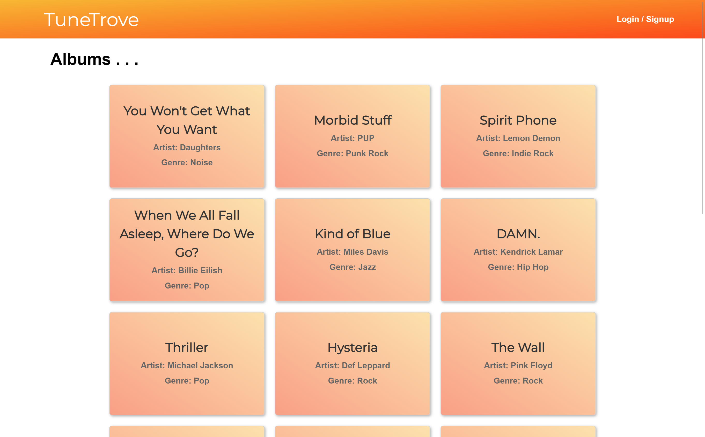

# Group Project #2: Interactive Full-Stack Application - "TuneTrove"

  

  ## Table of Contents
  
  - [Table of Contents](#table-of-contents)
  - [Description](#description)
  - [License](#license)
  - [Questions](#questions)
  - [Images](#images)

  ## Description

  https://agile-atoll-63979.herokuapp.com/
  
  This is an application built for the UNCC full-stack web develpoment bootcamp by Matt Lombard, Michael Hobert, and Josh Miller. The app, TuneTrove, seeks to provide users with a platform to discover new music and share their own findings via a community-driven review system. Users can view artist and album data, as well as post and read entries regarding those releases. 

  ## Contributors

  https://github.com/MattLombard 
  https://github.com/MichaelHobert01 
  https://github.com/Nevermindlessly

  ## Images

  